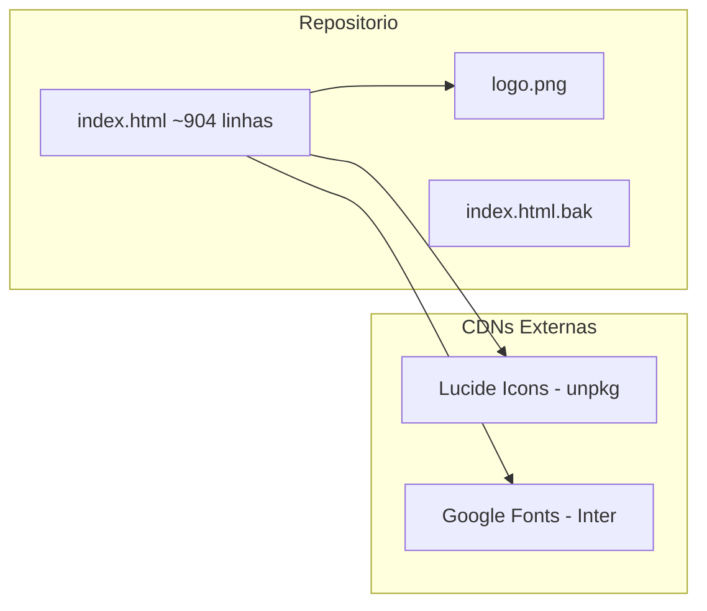
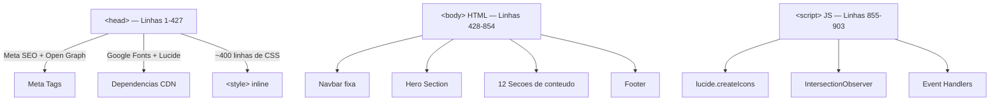
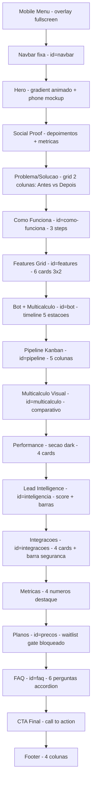
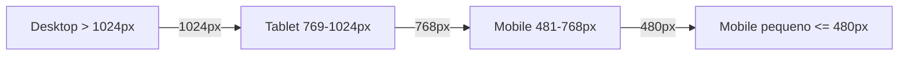
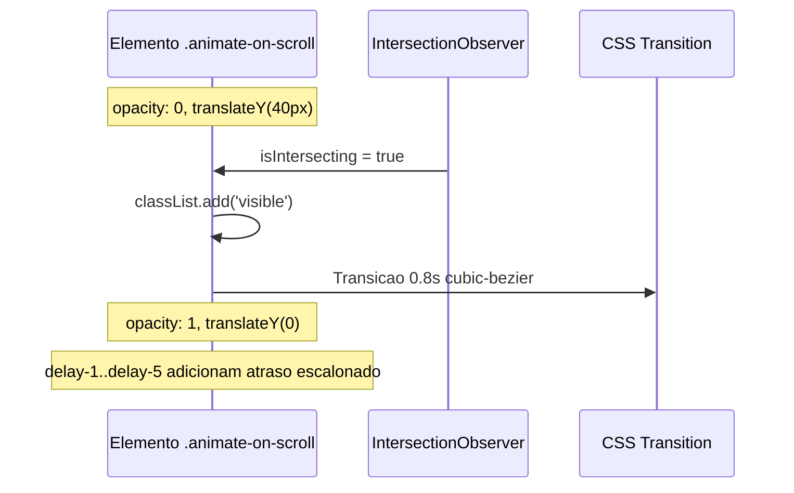
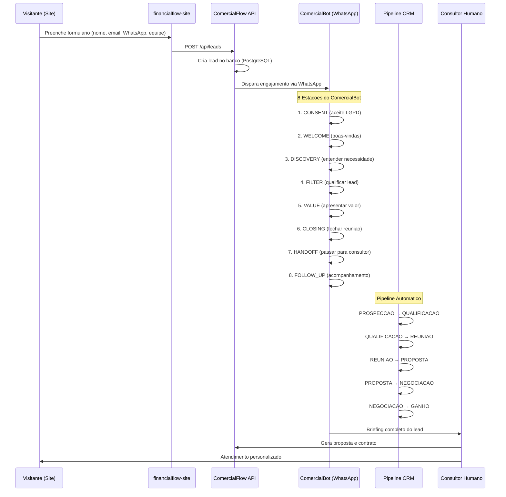
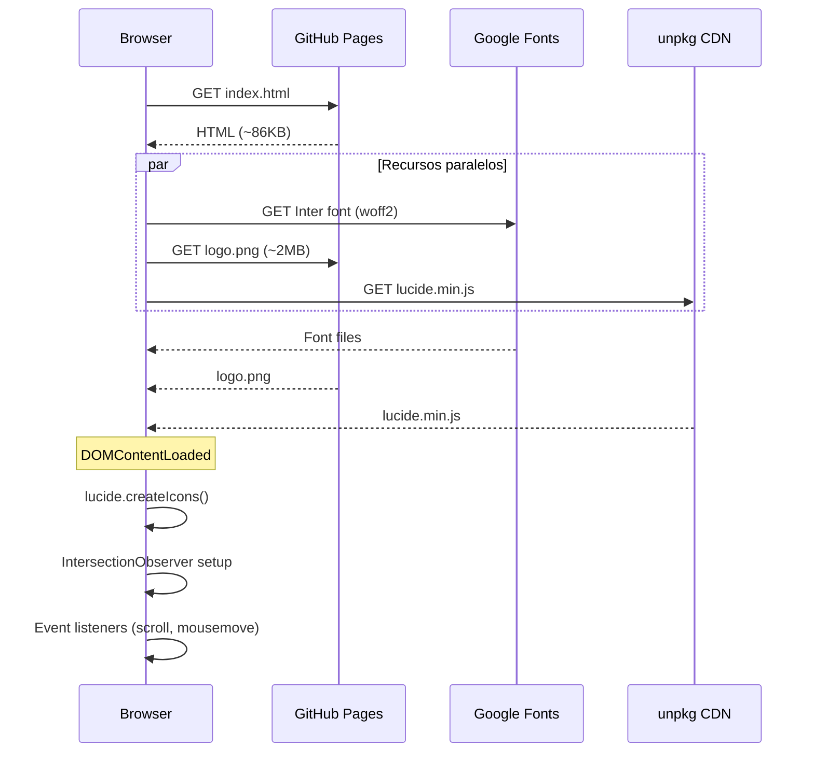

# 02 - Arquitetura do Projeto

**Projeto:** financialflow-site (Landing Page do LeadFlow Financial)
**Data:** 2026-03-09
**Tipo:** Site estatico (HTML/CSS/JS inline) — Single Page

---

## Visao Geral

O financialflow-site e uma landing page estatica de arquivo unico (`index.html`, ~904 linhas) que apresenta o produto LeadFlow Financial — um CRM com IA e Multicalculo voltado para assessores de investimento. Nao ha framework, bundler ou build step. Todo o CSS e JavaScript estao embutidos diretamente no HTML.



---

## Estrutura de Arquivos

```
financialflow-site/
├── index.html          # Pagina unica (HTML + CSS inline + JS inline)
├── index.html.bak      # Backup da versao anterior
├── logo.png            # Logo da marca (~2MB)
├── docs/               # Documentacao do projeto
│   └── ...
└── .git/               # Repositorio Git
```

**Total de arquivos de producao:** 2 (index.html + logo.png)

---

## Arquitetura do HTML

O arquivo `index.html` segue uma estrutura de tres blocos:



---

## Mapa de Secoes (DOM)

Todas as secoes seguem o padrao `<section class="nome-secao" id="ancora">` com container interno.



---

## Dependencias Externas

| Dependencia | Tipo | URL | Finalidade |
|---|---|---|---|
| **Google Fonts (Inter)** | CSS | `fonts.googleapis.com` | Tipografia principal (pesos 300-900) |
| **Lucide Icons** | JS (UMD) | `unpkg.com/lucide@latest` | Icones SVG renderizados via `data-lucide` |

Nao ha nenhuma outra dependencia. Sem jQuery, sem frameworks CSS, sem bundlers.

---

## Design System (CSS Custom Properties)

Todas as variaveis de design estao definidas em `:root` no bloco `<style>`:

### Paleta de Cores

| Variavel | Valor | Uso |
|---|---|---|
| `--primary` | `#10B981` | Verde principal (botoes, destaques) |
| `--primary-light` | `#34D399` | Verde claro (gradientes) |
| `--primary-dark` | `#059669` | Verde escuro (hover) |
| `--accent` | `#6366F1` | Roxo/indigo (gradientes, IA) |
| `--accent-light` | `#818CF8` | Roxo claro |
| `--gold` | `#F59E0B` | Dourado (performance, destaque) |
| `--danger` | `#EF4444` | Vermelho (lead quente, problemas) |
| `--cold` | `#3B82F6` | Azul (lead frio) |
| `--text` | `#0F172A` | Texto principal |
| `--muted` | `#64748B` | Texto secundario |
| `--bg` | `#F8FAFC` | Background alternativo |
| `--border` | `#E2E8F0` | Bordas e separadores |

### Espacamento e Forma

| Variavel | Valor |
|---|---|
| `--radius` | `16px` |
| `--radius-sm` | `10px` |
| `--radius-lg` | `24px` |
| `--max-w` | `1200px` |

### Sombras

| Variavel | Uso |
|---|---|
| `--shadow-sm` | Cards em repouso |
| `--shadow-md` | Cards em hover |
| `--shadow-lg` | Cards elevados, modais |

---

## Responsividade

Tres breakpoints com media queries:



### Comportamento por Breakpoint

| Breakpoint | Mudancas principais |
|---|---|
| **<= 1024px** | Hero empilha (1 coluna), features 2 colunas, footer 2 colunas, seta "how" some |
| **<= 768px** | Navbar vira hamburger, grids viram 1 coluna, pipeline empilha vertical, hero actions empilham |
| **<= 480px** | Performance e metricas viram 1 coluna, integracoes 1 coluna |

O menu mobile e um overlay fullscreen (`position:fixed; inset:0`) com `transform:translateX` para animacao de entrada/saida.

---

## JavaScript — Funcionalidades

Todo o JS esta inline no final do `<body>` (linhas 855-902), sem modules ou imports.

### Componentes JS

| Funcionalidade | Implementacao |
|---|---|
| **Icones Lucide** | `lucide.createIcons()` — renderiza todos os `[data-lucide]` |
| **Navbar scroll** | `scroll` listener que adiciona classe `.scrolled` quando `scrollY > 50` |
| **Menu mobile** | `toggleMobileMenu()` / `closeMobileMenu()` — toggle classe `.active` |
| **Scroll animations** | `IntersectionObserver` com threshold 0.1, adiciona `.visible` aos `.animate-on-scroll` |
| **Smooth scroll** | Listener em todos os `a[href^="#"]` com `scrollIntoView({ behavior: 'smooth' })` |
| **FAQ accordion** | `toggleFaq(btn)` — toggle classe `.open`, fecha outros items |
| **Chat replay** | `replayChat()` a cada 15s via `setInterval` — reseta animacoes das mensagens |
| **Parallax particles** | `mousemove` listener que translada `.particle` baseado na posicao do mouse |
| **Waitlist form** | `submitWaitlist(e)` — captura dados, loga no console, substitui form por mensagem de sucesso |

### Fluxo de Animacao no Scroll



---

## Animacoes CSS

| Keyframe | Uso | Duracao |
|---|---|---|
| `float` | Particulas do hero | 6s loop |
| `floatSlow` | Phone mockup e float cards | 6s / 5s loop |
| `pulse-glow` | Badge dot do hero | 2s loop |
| `fadeInUp` | Entrada do conteudo hero | 0.8s |
| `fadeInRight` | Entrada do phone visual | 1s |
| `gradient-shift` | Background animado do hero | 15s loop |
| `message-in` | Mensagens do chat mockup | 0.5s com delays escalonados |
| `dash` | Preenchimento do circulo SVG (score) | 1.5s |

---

## Secoes Detalhadas

### Hero (secao principal)

- Background: gradiente multi-cor com `animation: gradient-shift 15s`
- Grid decorativo (`hero-grid`) com linhas semi-transparentes
- 4 particulas com parallax no mousemove
- Phone mockup com chat WhatsApp animado (7 mensagens com delay escalonado)
- 3 floating cards com dados de contexto (Multicalculo, Perfil, Score)
- Stats: < 1 min resposta, 6+ instituicoes, 9 perfis

### Bot + Multicalculo (timeline)

Timeline vertical com 5 estacoes conectadas por linhas:
1. Lead chega pelo WhatsApp
2. Bot qualifica com IA
3. Coleta perfil de investidor
4. Multicalculo em paralelo (6+ instituicoes)
5. Entrega ao assessor com briefing

### Pipeline Kanban

5 colunas visuais simulando um board Kanban:
- Novo Lead → Qualificando → Simulacao → Proposta → Fechamento

### Multicalculo Visual

Dashboard mockup com cards comparativos de instituicoes (XP, BTG, Inter, Nubank) mostrando taxas e produtos. O melhor resultado recebe destaque visual (`.best`).

### Lead Intelligence

- Circulo SVG com score numerico (0-100) e gradiente animado
- Barras de progresso: Engajamento, Urgencia, Fit produto
- 4 features: Perfis Comportamentais, Temperatura, Educacao Financeira, Briefing

### Planos (Waitlist Gate)

Formulario bloqueado com 4 campos (nome, email, WhatsApp, tamanho da equipe). Nao exibe planos — funciona como lista de espera. O submit substitui o form por mensagem de confirmacao (sem backend real, apenas console.log).

---

## SEO e Meta Tags

```
<title>FinancialFlow | CRM com IA e Multicalculo para Assessores de Investimento</title>
<meta name="description" content="CRM inteligente para assessores de investimento..."/>
<meta name="theme-color" content="#10B981"/>
<meta property="og:title/description/type/locale"/>
<meta name="twitter:card/title/description"/>
```

Observacao: as tags `rel="preconnect"` para Google Fonts estao com typo (`preçonnect` em vez de `preconnect`), o que impede o pre-carregamento funcionar.

---

## Integracao com ComercialFlow

O formulario "Consulte seu agente comercial" (secao Planos/Waitlist) e o ponto de entrada para o **ComercialFlow**, o CRM B2B da SaltusCon.

### ComercialFlow

- **Repositorio:** [https://github.com/josejunior-dot/comercialflow](https://github.com/josejunior-dot/comercialflow)
- **Descricao:** CRM B2B com IA para gestao comercial, desenvolvido pela SaltusCon
- **Stack:** Next.js 16, React 19, Prisma 7, PostgreSQL, OpenAI GPT-4o-mini, WhatsApp Cloud API

### Fluxo Completo de Captacao



### Dados Enviados pelo Formulario

| Campo | Tipo | Destino no ComercialFlow |
|---|---|---|
| Nome completo | `string` | `lead.name` |
| Email | `string` | `lead.email` |
| WhatsApp | `string` | `lead.phone` (usado pelo ComercialBot) |
| Tamanho da equipe | `string` | `lead.metadata.teamSize` |

### Status Atual da Integracao

- **Formulario:** Implementado no site, porem faz apenas `console.log` dos dados
- **Integracao real:** Sera ativada quando o ComercialFlow estiver em producao
- **Endpoint planejado:** `POST /api/leads` do ComercialFlow
- **Acao necessaria:** Substituir o `console.log` no `submitWaitlist()` por um `fetch()` para a API do ComercialFlow

---

## Deploy

| Item | Valor |
|---|---|
| **Plataforma** | GitHub Pages |
| **Branch** | `master` |
| **Build** | Nenhum (arquivos servidos diretamente) |
| **Dominio** | Padrao GitHub Pages |

---

## Fluxo de Requisicoes (carregamento)



---

## Pontos de Atencao

1. **Logo pesado:** `logo.png` tem ~2MB — comprimir ou converter para WebP/AVIF reduziria significativamente o tempo de carregamento
2. **Typo no preconnect:** `preçonnect` (com cedilha) em vez de `preconnect` nas linhas 16-17, impedindo otimizacao de DNS
3. **Lucide @latest:** Usar `@latest` na CDN pode quebrar o site se a API mudar — fixar versao e recomendado
4. **Sem backend real:** O formulario de waitlist faz apenas `console.log` — precisa de integracao com API ou servico (ex: Google Sheets, Supabase, webhook)
5. **Arquivo unico:** Com ~900 linhas, o HTML e gerenciavel, mas qualquer expansao significativa pode beneficiar de separacao em arquivos CSS/JS dedicados
6. **Sem favicon:** Nao ha `<link rel="icon">` definido
